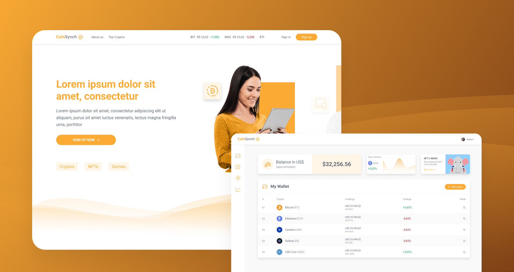
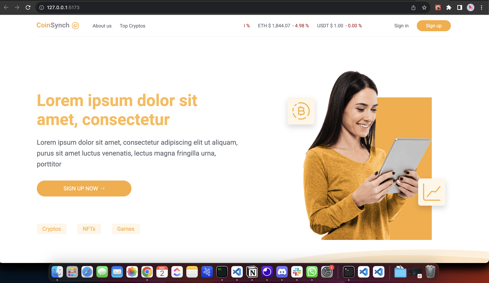
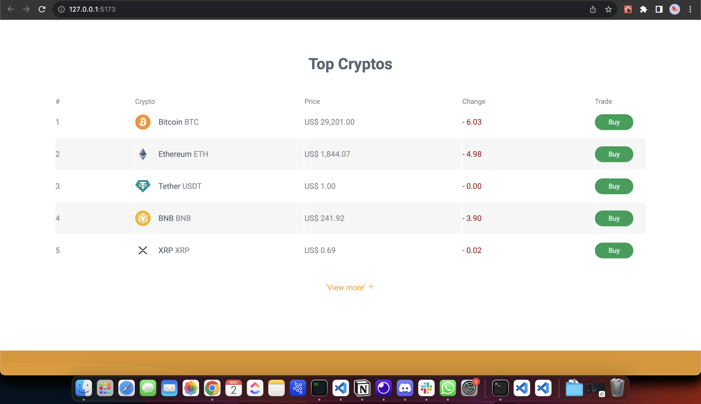
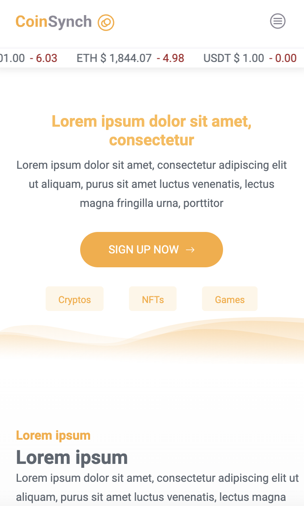
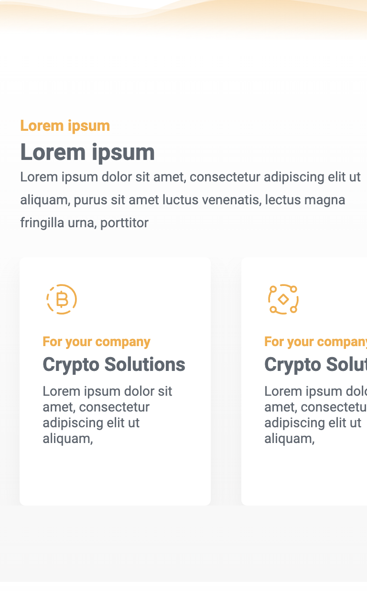
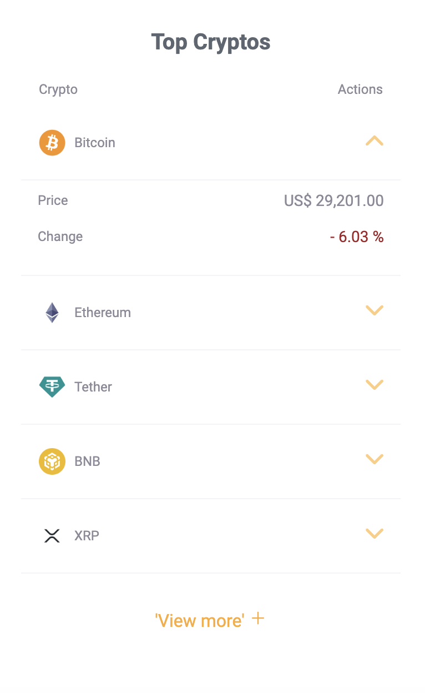
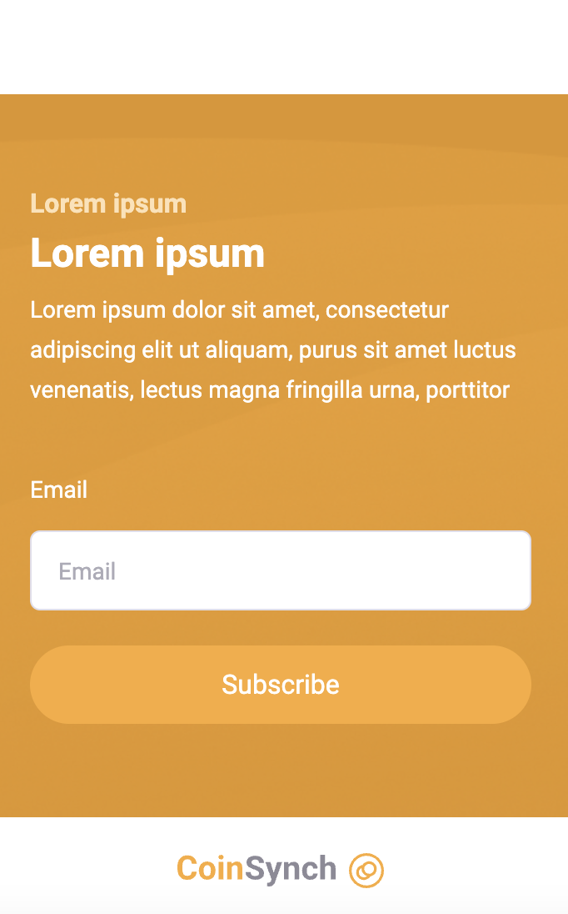
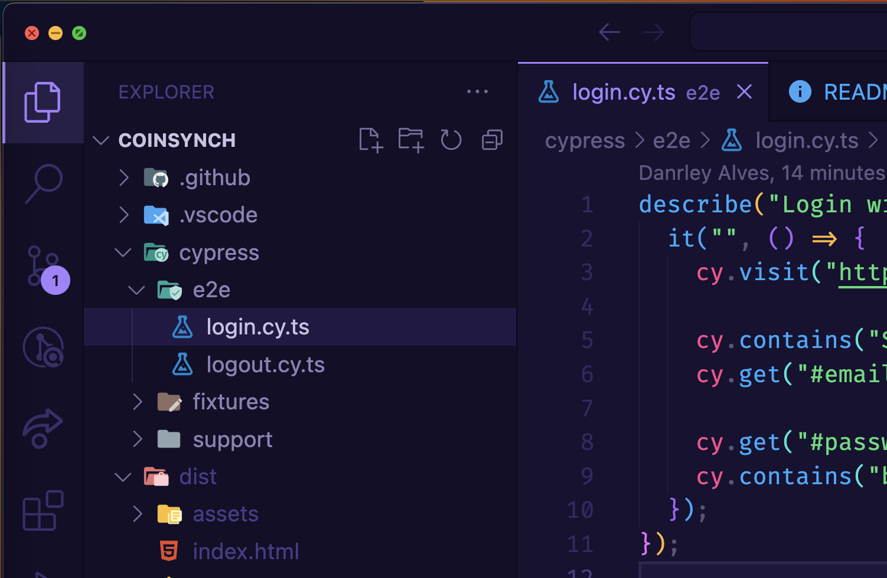
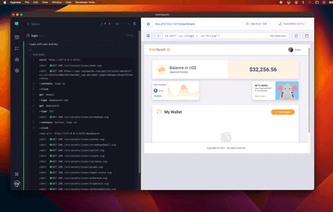

# React + TypeScript + Vite

<h1 align="center">
  
</h1>

> Status: concluído 🚀

### Desafio para desenvolvedor front-end para - EduSynch

### Descrição

## 💻 Sobre o desafio

Este desafio consiste no desenvolvimento da interface de uma landing page e uma dashboard. Os
mockups estão no figma:

- Projeto: https://www.figma.com/file/B8scopEM014WR4Oh58UaDb/%5BEduSynch%5D--Front-End-Test
- Landing Page:
  https://www.figma.com/file/B8scopEM014WR4Oh58UaDb/%5BEduSynch%5D--Front-End-Test?node-id=1%3A1741
- Dashboard:
  https://www.figma.com/file/B8scopEM014WR4Oh58UaDb/%5BEduSynch%5D--Front-End-Test?node-id=1%3A2555
- Protótipo:
  https://www.figma.com/proto/B8scopEM014WR4Oh58UaDb/%5BEduSynch%5D--Front-End-Test?node-id=1%3A9253&scaling=min-zoom&page-id=1%3A9229&starting-point-node-id=1%3A9253&hide-ui=1

Deverá ser utilizado ReactJS (opcional a utilização de algum framework como NextJS) para
desenvolvimento da landing e dashboard;

OBSERVAÇÃO: Para interações com API, sugerimos o uso de uma fake API, como o json-server.

## 🔖 Layout

Você pode visualizar o layout do projeto através desse
<a href="https://www.figma.com/file/2OU7V5IgEWYbEqCKvUE36j/LP---Teste-Front-End">link</a>. Vale
lembrar que você precisa ter uma conta no Figma para acessá-lo. (O cadastro é gratuito)

## ⚡️ Funcionalidades

#### Landing page:

- Os dados das crypto moedas no topo da página deverão ser carregados da API Rest (SUGESTÃO:
  https://www.coinapi.io/)
- O Banner do topo deverá ser em forma de carrossel (Mais detalhes no figma)
- Os dados das crypto moedas na seção de "Top Cryptos" deverão ser carregados da API Rest (SUGESTÃO:
  https://www.coinapi.io/)
  - Ação do botão "View more +" deverá mostrar lista completa (10 itens);
  - Após expandir a lista, o texto "View more +" deverá ser substituido por "View less";
- O formulário de Newsletter no rodapé da página deverá ter interação a API Rest
  - Implementar ação de "Loading" desabilitando o botão de "Subscribe" até o retorno do servidor;
  - Enquanto a ação de subscribe estiver sendo processada o usuário não poderá alterar o campo
    e-mail (desabilitar o preenchimento do input de texto);
  - Após retorno de sucesso do servidor, o campo e-mail deve ser limpo e o botão "Subscribe" deve
    estar disponível novamente;
- O botão "Sign in" deverá abrir um dialog conforme o layout;
  - O input de e-mail deverá ser validado (e-mail válido)
  - O input de password deverá ter a ação de mostrar / esconder a senha (clicando no ícone de olho);
  - "Forgot password?" não deverá ser implementado (apenas um link fake);
- O botão de "Sign Up" e o link "Don’t have an account? Sign up to CoinSynch" deverão abrir o dialog
  "Sign Up" conforme o figma;
  - Os campos "Name", "Email", "Password", "Confirm Password" e o checkbox "I have read and accept
    the Privacy Policy and Terms of User Sign up." deverão ser obrigatórios;
  - O input de e-mail deverá ser validado (e-mail válido)
  - Os inputs Passwords e Confirm Password deverão ser iguais para se tornarem válidos;
  - Ao clicar no link "Already have and account? Sign in to CoinSynch" a aplicação deverá abrir o
    Dialog de "Sign in" no lugar do "Sign Up";

#### Dashboard:

- O topo da página deverá ter as informações do usuário (Avatar e Nome, esses dados deverão ser
  consumidos da API Rest)
- O topo também deverá ter um dropdown com uma única opção (Logout);
- Menu lateral com tooltip deverá ter as funções de expandir e minimizar;
- Conteúdo deve ser exibido com os dados consumidos da API;
- O valor exibido no bloco "Balance in US$" deverá ser formatado;
- O bloco "Daily Variation" deverá mostrar um gráfico com dados consumidos da API;
- O bloco "My Wallet" deverá mostrar a lista com dados consumidos da API;
- O botão "Add Crypto" deverá exibir o dialog "Add Crypto" com um select consumindo dados da API;
- Ao clicar no botão "Add Crypto" a listagem no bloco "My Wallet" deverá ser atualizado;
- Ao clicar no ícone da listagem do bloco "My Wallet", deverá ser exibido o dialog de "Transfer
  Crypto";
- O Select de "Transfer" deverá listar as opções "Transfer in" e "Transfer out";
- Caso usuário transfira todo o valor da moeda selecionada, o item deverá ser removido da listagem
  do bloco "My Wallet";
- O campo "Quantity" não deverá ter valor negativo;
- Ao remover todas as moedas da sua carteira, deverá ser exibida a mensagem de "Empty data" no bloco
  "My Wallet".

### Tecnologias Usadas

- React
- Vite
- Typescript

# 🎨 Layout

#### Desktop

<h1 align="center">
  
</h1>

<h1 align="center">
  
</h1>

#### Mobile

<h1 align="center" >
  

  

   

  
</h1>

### Teste automatizado de Login com Cypresscom usando credenciais

> Teste realizado para efetuar Login para ser direcionado ao dashboard.
>
> > Para exeutar o teste basta rodar o comando: yarn cypress open.
> >  >
> > 

## Como executar o projeto ? 🚀

> Clone este repositório :

1 - git clone https://github.com/danrleyney2210/CoinSynch.git

2 - Acesse a pasta do projeto no seu terminal/cmd:

> cd coinSynch

3 - check se esta na banch develop 4 - Instale as dependências :

> **yarn** ou **npm install**

4 - Execute a aplicação em modo de desenvolvimento

> **yarn dev** ou **npm run dev**

#### Comandos para build

> yarn build

### Usuário e senha para LOGIN

> Email : eu@asynch.com Senha: 123

---

# 🛠 Tecnologias

> Principais dependências usadas no projeto: 🔥

- Website (React + Vite + Typescript)

- React Icons - Biblioteca de icones.

- Styled Components - CSS-in-js

- Prettier - Formatador de código opinativo.

- Cypress - Para testes automatizado e testes em library.

- Eslint - Ferramenta para identificar e relatar os padrões encontrados no código ECMAScript /
  JavaScript, com o objetivo de tornar o código mais consistente e evitar bugs.

- Axios - Cliente HTTP baseado em promessa para node. jse o navegador.

- react-lottie - Para animações utilizando o formato JSON

- react-toastify - Para Feedback e alertas personalizados.

Veja o arquivo <a>package.json</a>

> Utilitários

- Protótipo: Figma
- Editor: Visual Studio Code

---

### 🦸 Desenvolvedor 🤘

Feito com ❤️ por Danrley Ney 👋🏽 Entre em contato!

> Email: danrley.dev@gmail.com

> www.danrley.dev

> Twitter: @danrleyney
